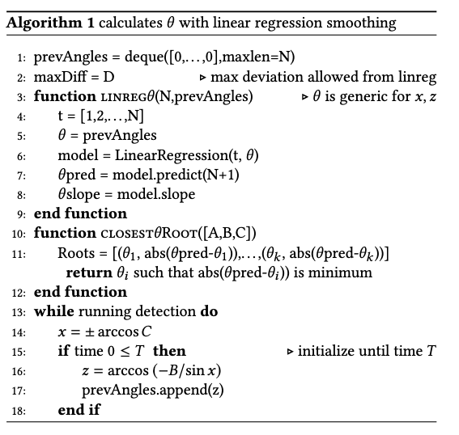
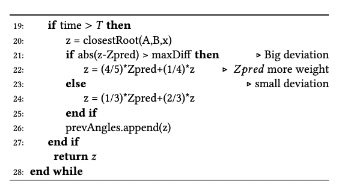
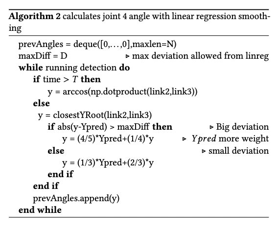
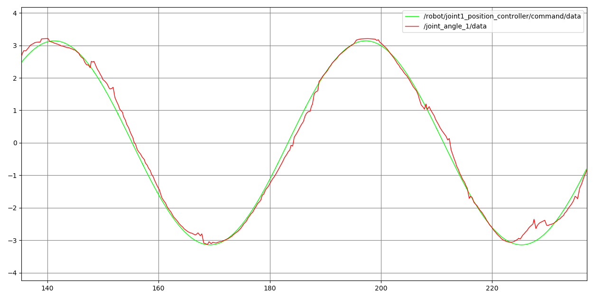
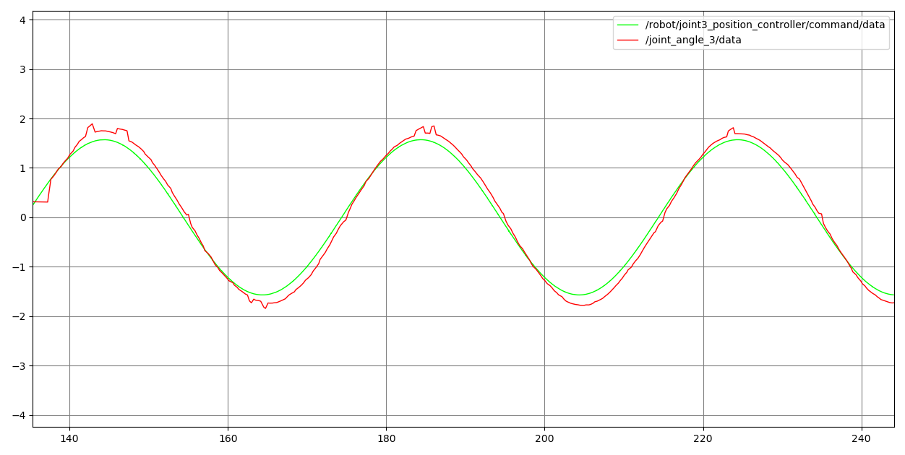
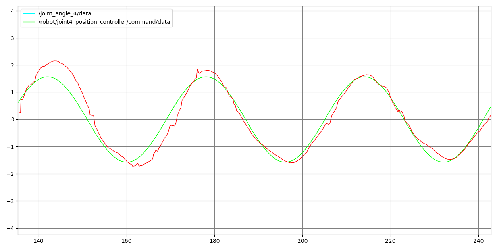
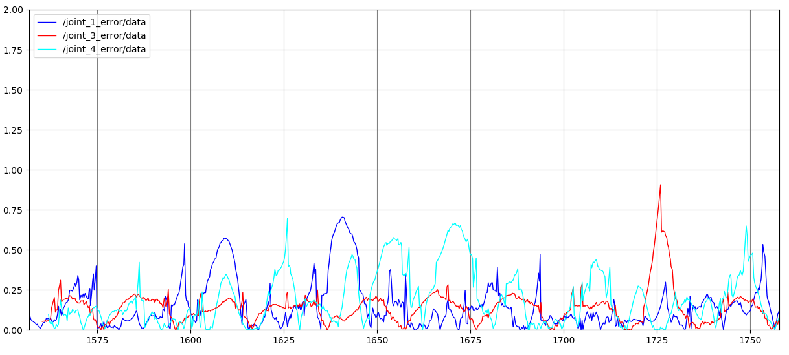

# Robot Arm Controller

This repo contains a stereo camera inverse kinematic control algorithm. The images from the cameras are processed using opencv. The joint positions are first calculated, and then using the following two algorithms, the forward kinematics are calculated.

# Forward Kinematic Algorithms

# Joint detection results
For the following results, joint 2 was fixed while joints 1,3,4 are programmed to move in different sinusoidal patterns. Green denotes ground truth.

# Error rates

